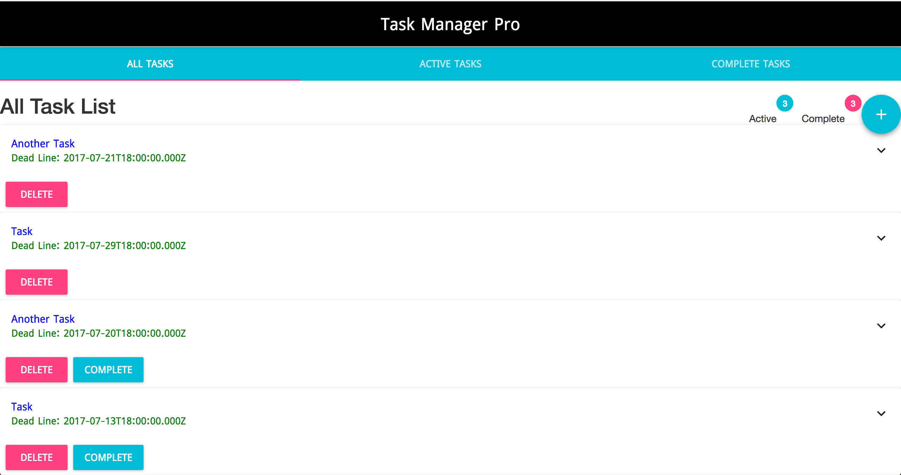
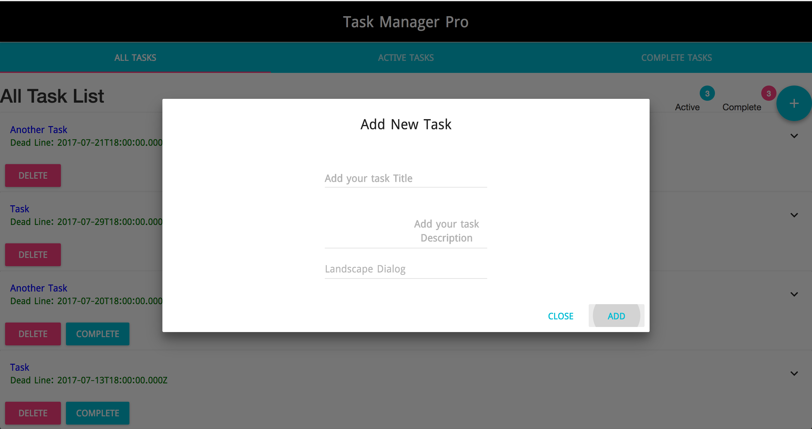

# Task Manager
<a href="https://codeclimate.com/github/codeclimate/codeclimate"></a>

Simple task manager project.

## Getting Started

This is a simple react.js task management react project.
User can create task with title, description and deadline. And mark it as complete.
Also can delete tasks.

### Project structure
This project is **Organize by feature**. All feature contain in module folder.

For maintaining **strict module boundaries** all public api export with index.js.

All common component of project keep in src/component folder.

### Project screenshot
 '



### Project source structure
 following structure maintain for redux integration:
 ```
    src
    ├── assets
    │   ├── images
    │   │   └── logo.svg
    │   └── stylesheets
    │       ├── app.css
    │       ├── header.css
    │       └── index.css
    ├── components
    │   ├── app.jsx
    │   └── header.jsx
    ├── index.js
    ├── modules
    │   └── tasks
    │       ├── action_types.js
    │       ├── actions.js
    │       ├── assets
    │       │   └── stylesheets
    │       │       ├── add_task.css
    │       │       ├── task_canvas.css
    │       │       └── task_statistics.css
    │       ├── components
    │       │   ├── active_tasks_list.jsx
    │       │   ├── add_tasks.jsx
    │       │   ├── all_tasks_list.jsx
    │       │   ├── complete_tasks_list.jsx
    │       │   ├── index.js
    │       │   ├── task_canvas.jsx
    │       │   ├── task_item.jsx
    │       │   └── task_statistics.jsx
    │       ├── constants.js
    │       ├── index.js
    │       ├── model.js
    │       ├── reducer.js
    │       └── selectors.js
    └── root_reducer.js
 ```

### Major npm packages
* redux - Using for container state management.
* reselect - Using for create query selector of redux state.
* sfcookies - Using for save state data in browser cookie.
* material-ui - Using for UI design.

### Prerequisites

Need latest version of npm.

### Installing

For development setup run:
    ```
        $ npm install
    ```

For transform bundle js run:
    ```
        $ npm run create
    ```

Run project:
    ```
        $ npm start
    ```

## Authors

* **Tanvir Hasan** - *Initial work* - [tanvir002700](https://github.com/tanvir002700)

## License

This project is licensed under the MIT License - see the [LICENSE.md](LICENSE.md) file for details

## Acknowledgments

* *Three Rules For Structuring (Redux) Applications* - [Jack Hsu, Blog Link](https://jaysoo.ca/2016/02/28/organizing-redux-application/)
